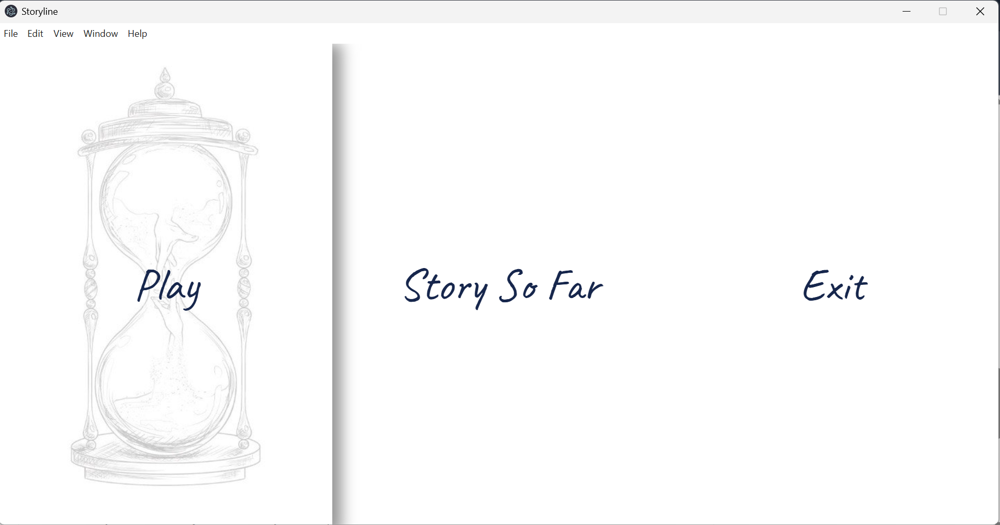
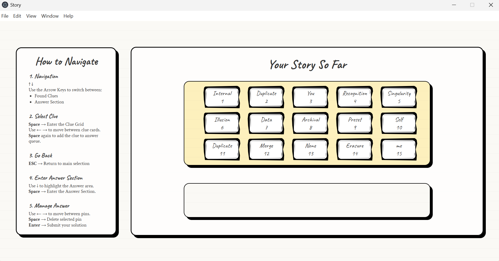
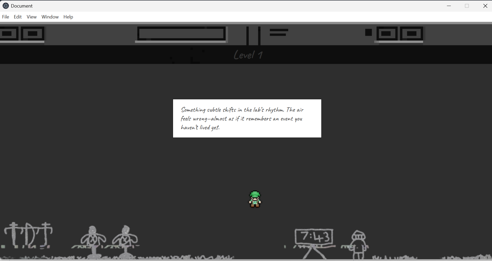

# StoryLine

Storyline is a chapter-based, immersive corridor-style narrative game where players explore fragmented timelines through first-person movement.
You play as Dr. Li An, whose consciousness becomes trapped inside a broken temporal system known as the Chronos Core.
Your goal: uncover the truth, recover your identity, and escape — before the system replaces you.

---

## Team Members
- **Konstantin A. Yakovlev** - Project Lead
- **Yuan Zicheng** - Visual Design Team
- **Lin Chenxiong** - Visual Design Team
- **Li Songyao** - Visual Design Team
- **Wang Yongyi** - Visual Design Team
- **Klarissa Witania** - UI/UX and Frontend Designer
- **Amir Hazif Dahnill** - Gameplay Developer

---

## Game Overview

Storyline blends exploration with narrative decision-making.
Each chapter presents a corridor with environmental hints, illusions, and system glitches that reveal the truth about your identity.

### Features:
- First-person movement
- Environmental storytelling
- Interactive end-of-level questions
- Logical chain-based final ending
- 15 levels across 3 narrative chapters

### Controls:
- **WASD:** Move
- **Space:** Jump
- **Interaction:** Auto-trigger at level endpoints

---

## Screenshots




---

## Setup & Installation

A basic game structure has already been added to the `main` branch.  
Follow the steps below to run the project locally.

### 1. Install Node.js
Make sure you have **Node.js** installed on your computer.  
Download it from the official website: https://nodejs.org/

### 2. Clone the Repository
```bash
git clone <your-repo-url>
cd <your-project-folder>
```

### 3. Install Dependencies
Once inside the project folder, run:
```bash
npm i
```

### 4. Start the Development Server
```bash
npm run start
```
